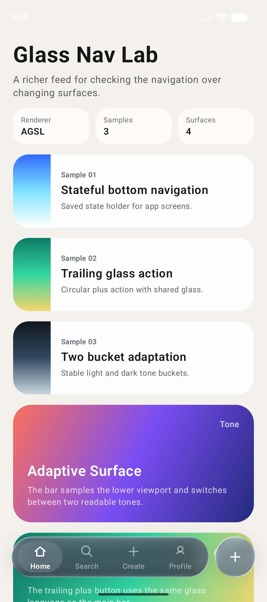
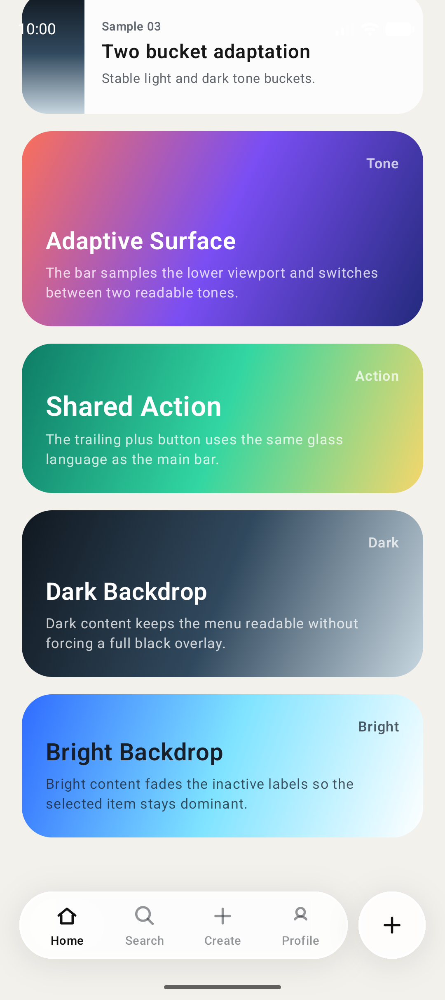
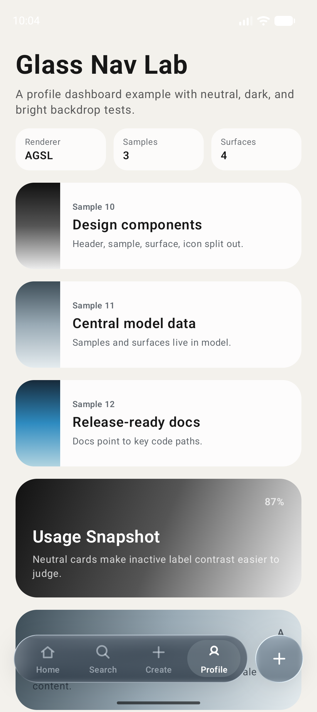

# glass-nav-compose

Adaptive glass bottom navigation for Jetpack Compose.

This repository contains a demo Android app that experiments with a Liquid Glass-inspired bottom navigation pattern using Compose.

The renderer is split into two paths:

- Android 13+: backdrop blur/refraction plus a direct `RuntimeShader` AGSL overlay for rim light, sheen, and active liquid distortion.
- Android 12 and lower: the same component API with the lens/AGSL overlay disabled.

The backdrop library is still used to capture and blur content behind the bar. The AGSL code in this repo is the procedural glass surface layer, not a replacement for background capture.

## Preview

Screenshots are stored under `docs/assets`.

<p align="center">
  
  
  
</p>

## Features

- Jetpack Compose bottom navigation component
- Direct AGSL surface shader on supported Android versions
- Backdrop-based blur/refraction for content behind the bar
- Legacy blur fallback for older Android versions
- Two-step light/dark material adaptation based on background luminance
- Flat selected pill after selection settles
- Glass transition while pressing, long-pressing, or dragging between items
- Reusable circular glass action button
- Multi-tab demo app with Home, Search, Create, and Profile examples
- Separated demo design components and sample model data

## Package

The reusable component code is under:

```text
app/src/main/java/app/thdev/myapplication/ui/components/liquidglass
```

Direct AGSL entry point:

```text
app/src/main/java/app/thdev/myapplication/ui/components/liquidglass/LiquidGlassAgslOverlay.kt
```

Demo app usage is under:

```text
app/src/main/java/app/thdev/myapplication/ui/demo/LiquidGlassDemoScreen.kt
```

Demo design components and sample data are under:

```text
app/src/main/java/app/thdev/myapplication/ui/demo/components
app/src/main/java/app/thdev/myapplication/ui/demo/model
```

## Agent Skill

This repository includes a repo-local agent skill for future Android/Compose work:

```text
.agents/skills/android-liquid-glass-compose/SKILL.md
```

## Run

```bash
./gradlew :app:installDebug
```

## Notes

This is not an Apple API implementation. It is a Compose approximation of a glass navigation interaction pattern for Android.
